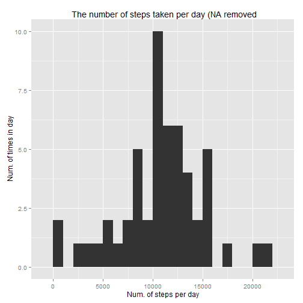
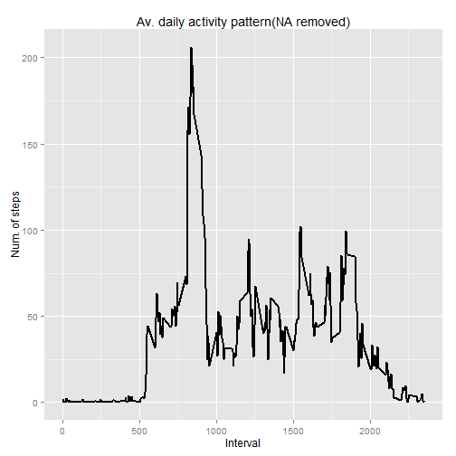
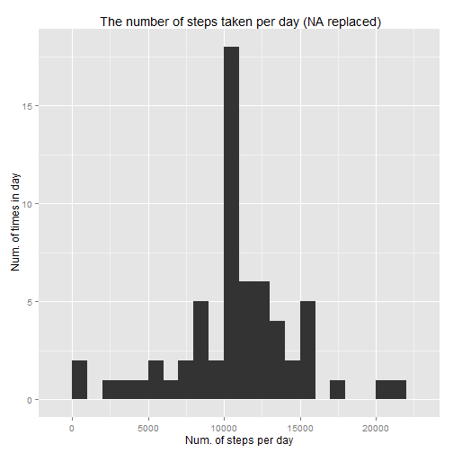
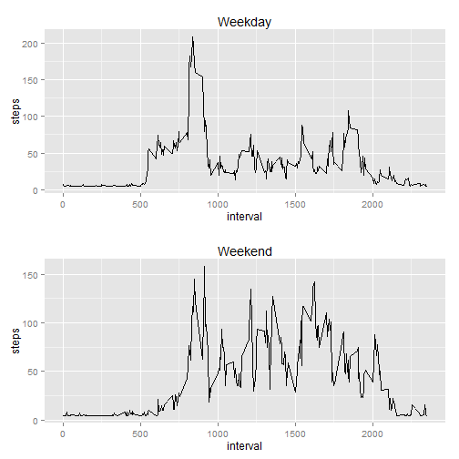

PA1
==============================

Loading and preprocessing the data


```r
setwd("C:/Users/Asus/Desktop/Data Science Coursera/Reproducible Research/")

unzip("C:./repdata-data-activity.zip")

activity <- read.csv("activity.csv")

library(dplyr)
```

Removing NA steps from data frame


```r
activity1 <- filter(activity, !is.na(steps))
```

Grouping the dataset by date


```r
activity_date <- group_by(activity1, date)
```

Calculate the total steps per day


```r
activity_steps <- aggregate(steps ~ date, activity1, sum)
colnames(activity_steps) <- c("date", "steps")
head(activity_steps)
```

```
##         date steps
## 1 2012-10-02   126
## 2 2012-10-03 11352
## 3 2012-10-04 12116
## 4 2012-10-05 13294
## 5 2012-10-06 15420
## 6 2012-10-07 11015
```

Plot the histrogram to illustate the number of steps per day


```r
library(ggplot2)
ggplot(activity_steps, aes(x=steps)) + 
  geom_histogram(binwidth = 1000)+
  labs(title= " The number of steps taken per day (NA removed",
       x = "Num. of steps per day",
       y = " Num. of times in day") 
```

 

To calculate the mean and median of the steps taken per day


```r
mean(activity_steps$steps)
```

```
## [1] 10766.19
```

```r
median(activity_steps$steps)
```

```
## [1] 10765
```

The mean is 10766 and median is 10765

To find what is the average daily activity pattern


```r
activity_pattern <- aggregate(activity1$steps,
                              by = list(interval= activity1$interval),
                              FUN=mean, na.rm=TRUE)
colnames(activity_pattern) <- c("interval", "steps")
head(activity_pattern)
```

```
##   interval     steps
## 1        0 1.7169811
## 2        5 0.3396226
## 3       10 0.1320755
## 4       15 0.1509434
## 5       20 0.0754717
## 6       25 2.0943396
```

Plot a line graph to track the av. daily activity pattern


```r
ggplot(activity_pattern, aes(x=interval, y=steps)) + 
  geom_line(size=1) + 
  labs (title= "Av. daily activity pattern(NA removed)", x="Interval", y="Num. of steps")
```

 

To find out which 5-min interval, on average across all the days in the dataset, contains the maximum number of steps?


```r
max_int <- activity_pattern[which.max(activity_pattern$steps),]
```

The answer is 835th interval with a max. of 206 steps

Calculate the total number of missing values in the dataset (i.e. the total number of rows with NAs)


```r
na_steps <- sum(is.na(activity$steps))
```

the total number of missing values is 2304

Devise a strategy for filling in all of the missing values in the dataset. In this case, I'm using mean of the steps to replace NA


```r
mean_na <- rep(mean(activity$steps, na.rm=TRUE), times=length(which(is.na(activity$steps))))

activity[which(is.na(activity$steps)), "steps"] <- mean_na

head(activity)
```

```
##     steps       date interval
## 1 37.3826 2012-10-01        0
## 2 37.3826 2012-10-01        5
## 3 37.3826 2012-10-01       10
## 4 37.3826 2012-10-01       15
## 5 37.3826 2012-10-01       20
## 6 37.3826 2012-10-01       25
```

Make a histogram of the total number of steps taken each day


```r
activity_fill <- aggregate(activity$steps, by=list(activity$date), FUN=sum)
colnames(activity_fill) <- c("date", "total")

ggplot(activity_fill, aes(x=total)) + 
  geom_histogram(binwidth = 1000)+
  labs(title= " The number of steps taken per day (NA replaced)",
       x = "Num. of steps per day",
       y = " Num. of times in day")
```

 

Calculate and report the mean and median total number of steps taken per day.


```r
mean(activity_fill$total)
```

```
## [1] 10766.19
```

```r
median(activity_fill$total)
```

```
## [1] 10766.19
```

The mean and median are 10766. Mean remains unchanged, but median has increased. After filling up the NA values, mean and median become equal.

Create a new factor variable in the dataset with two levels - "weekday" and "weekend"


```r
library(lubridate)
```

Lubridate is an R package that makes it easier to work with dates and times.


```r
activity <- mutate(activity, weekend=factor(weekdays(ymd(date)) %in% c("Saturday", "Sunday")))
```

group by weekend and interval


```r
grp_activity <- group_by(activity, weekend, interval)

grp_activity_mean <- group_by(grp_activity, steps=mean(steps))
```

Make a panel plot containing a time series plot (i.e. type = "l") of the 5-minute interval (x-axis) to show the differences between weekday and weekend


```r
wday <- ggplot(data=subset(grp_activity_mean, weekend==FALSE), aes(x=interval, y=steps)) + geom_line() + 
  ggtitle("Weekday")

wend <- ggplot(data=subset(grp_activity_mean, weekend==TRUE), aes(x=interval, y=steps)) + geom_line() + 
  ggtitle("Weekend")
```

to compare both plots


```r
library(gridExtra)

grid.arrange(wday, wend, ncol=1)
```

 


